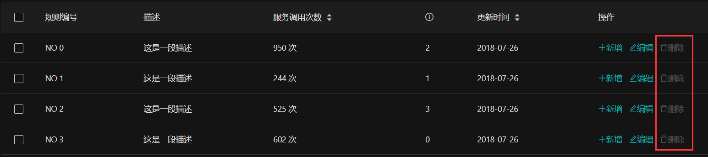

# 权限管理
权限控制是中后台系统中常见的需求之一，你可以利用 Vue Antd Admin 提供的权限控制脚手架，实现一些基本的权限控制功能。
## 操作权限
在一些复杂的些场景下，权限可能不仅仅是页面层级这么简单。在一些页面你可能需要校验用户是否具有某些操作的权限，比如 增、删、改、查等。  
为此，我们提供了 `权限校验注入` 和 `权限校验指令` 两个实用的功能。
### 权限校验注入
通过对Vue组件的实例方法进行 `权限校验注入`，我们可以控制该实例方法的执行权限，从而精准且安全的验证用户操作。  

比如，QueryList 页面的 deleteRecord 方法，我们希望具有操作权限 `delete` 的用户才能调用此方法。
只需为 `deleteRecord` 方法注入权限校验，按如下方式配置 `authorize` 即可：
```vue {9-11,13}
<template>
  ...
</template>
<script>
...
export default {
  name: 'QueryList',
  data () {...},
  authorize: {              //权限校验注入设置
    deleteRecord: 'delete'  //key为需要注入权限校验的方法名，这里为 deleteRecord 方法；值为需要校验的操作权限，这里为 delete 操作权限
  },
  methods: {
    deleteRecord(key) {
      this.dataSource = this.dataSource.filter(item => item.key !== key)
      this.selectedRows = this.selectedRows.filter(item => item.key !== key)
    },
    ...
  }
}
</script>
```
如果用户没有 `delete` 权限，调用 deleteRecord 方法，会看到如下提示：  


### 权限校验指令
有时我们可能希望用户能够更直观的了解自己的操作权限。比如给没有操作权限的控件应用 disable 样式，禁用 click 事件等。
我们提供了权限校验指令 `v-auth` 来实现这个功能。  

比如，我们想为 QueryList 页面的删除控件进行 `delete` 操作权限校验，只需为删除控件设置 v-auth="\`delete\`" 指令即可，如下：
```vue {6}
<template>
  <a-card>...
    <standard-table ...>
      ...
      <div slot="action" slot-scope="{text, record}">
        <a @click="deleteRecord(record.key)" v-auth="`delete`">
          <a-icon type="delete" />删除
        </a>
      </div>
      ...
    </standard-table>
  </a-card>
</template>
```
假如用户没有 `delete` 操作权限，则控件会被应用 disable 样式，且 click 事件无效，如下图：  


:::warning 重要！！！
v-auth 是我们自定义的一个 [Vue指令](https://cn.vuejs.org/v2/guide/custom-directive.html#ad)。因为 `Vue指令` 的值需要是一个 javascript 表达式，因此你不能直接给 v-auth 赋值为字符串，
需要把 v-auth 的字符串值用 ` `` ` 包裹起来，否则可能会报 undefined 错误。
:::
## 异步路由权限
异步路由同样可以进行权限校验配置，它和正常的路由权限配置基本无异，只是无需把 [authority](#页面权限) 配置在元数据属性 meta 里。
你可以在路由组件注册时设置 authority，也可以在异步路由配置里设置 authority。  

路由组件注册时设置 [authority](#页面权限)：
```js {6}
// 路由组件注册
const routerMap = {
  ...
  demo: {
    name: '演示页',
    authority: 'form',
    component: () => import('@/pages/demo')
  }
  ...
}
```

异步路由配置里设置 [authority](#页面权限)：
```js {11-13}
const routesConfig = [{
    router: 'root',
    children: ['demo',
      {router: 'parent1'...},
      ...
      {
        router: 'demo',
        icon: 'file-ppt',
        path: 'auth/demo',
        name: '验权页面',
        authority: 'form'
      }
    ]
  }]
```
