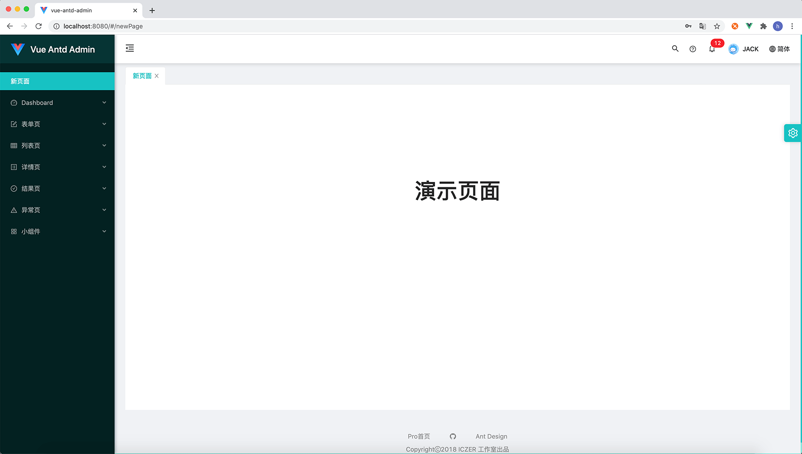
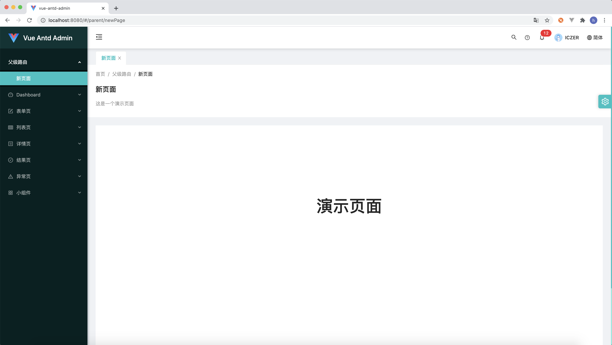
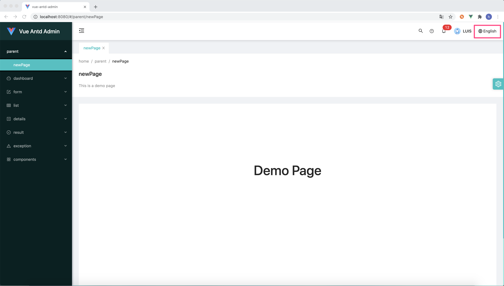

# 页面
这里的『页面』包含新建页面文件，配置路由、样式文件及i18n国际化等。通常情况下，你仅需简单的配置就可以添加一个新的页面。
## 新建页面文件
在 src/pages 下创建新的 .vue 文件。如果页面相关文件过多，您可以创建一个文件夹来放置这些文件。
```diff                    
  ├── public
  ├── src
  │   ├── assets               # 本地静态资源
  :   :
  │   ├── pages                # 页面组件和通用模板
+ │   │   └── NewPage.vue      # 新页面文件
or
+ │   │   └── newPage          # 为新页面创建一个文件夹
+ │   │       ├── NewPage.vue  # 新页面文件
+ │   │       ├── index.less   # 页面样式文件
+ │   │       └── index.js     # import 引导文件
  :   :
  │   └── main.js              # 应用入口js
  ├── package.json             # package.json
  ├── README.md                # README.md
  └── vue.config.js            # vue 配置文件
```
为了更好地演示，我们初始化 NewPage.vue 文件如下：
```vue
<template>
  <div class="new-page" :style="`min-height: ${pageMinHeight}px`">
    <h1>演示页面</h1>
  </div>
</template>
<script>
  import {mapState} from 'vuex'
  export default {
    name: 'NewPage',
    data() {
      return {
        desc: '这是一个演示页面'
      }
    },
    computed: {
      ...mapState('setting', ['pageMinHeight']),
    }
  }
</script>
<style scoped lang="less">
@import "index.less";
</style>
```
index.less 文件：
```less
.new-page{
  height: 100%;
  background-color: @base-bg-color;
  text-align: center;
  padding: 200px 0 0 0;
  margin-top: -24px;
  h1{
    font-size: 48px;
  }
}
```
index.js 文件：
```js
import NewPage from './NewPage'
export default NewPage
```
## 配置路由
路由配置在 src/router/config.js 文件中，我们把上面创建的页面文件加入路由配置中
```js {10-14}
const options = {
  routes: [
    {name: '登录页'...},
    {
      path: '/',
      name: '首页',
      component: TabsView,
      redirect: '/login',
      children: [
        {
          path: 'newPage',
          name: '新页面',
          component: () => import('@/pages/newPage'),
        },
        {
          path: 'dashboard',
          name: 'Dashboard',
          meta: {
            icon: 'dashboard'
          },
          component: BlankView,
          children: [...]
        }
      ]
      ...
    }
  ]
}
```
:::tip
我们建议使用英文设置路由的 path 属性，用中文设置路由的 name 属性。因为系统将自动提取路由的 path 和 name 属性作为国际化配置。这在后面的章节
 [进阶>国际化](../advance/i18n.md)中将会讲到。
 当然，如果你的项目不需要国际化，可以忽略。
:::
启动服务，你将看到新增页面如下：

如果你想把它配置为二级页面或更深层级的页面，只需为它配置一个父级路由，并为父级路由配置一个[视图组件](./layout.md#admin-的视图)，
这里我们选择 [PageView](https://e.coding.net/y1252432332/ziyanxiangmu/vue-antd-admin.git/blob/master/src/layouts/PageView.vue)，如下：
```js {10-21}
const options = {
  routes: [
    {name: '登录页'...},
    {
      path: '/',
      name: '首页',
      component: TabsView,
      redirect: '/login',
      children: [
        {
          path: 'parent',
          name: '父级路由',
          component: PageView,
          children: [
            {
              path: 'newPage',
              name: '新页面',
              component: () => import('@/pages/newPage'),
            }
          ]
        },
        {name: 'dashboard'...}
      ]
      ...
    }
  ]
}
```
:::warning
页面所有父级路由的组件必须配置为[视图组件](../develop/layout.md#admin-的视图)，否则页面的内容可能不会显示。  
目前有 [PageView](https://e.coding.net/y1252432332/ziyanxiangmu/vue-antd-admin.git/blob/master/src/layouts/PageView.vue)、
[TabsView](https://e.coding.net/y1252432332/ziyanxiangmu/vue-antd-admin.git/blob/master/src/layouts/tabs/TabsView.vue) 和
[BlankView](https://e.coding.net/y1252432332/ziyanxiangmu/vue-antd-admin.git/blob/master/src/layouts/BlankView.vue) 可选，
你也可以自己创建视图组件。（[什么是视图组件？](../develop/layout.md#admin-的视图)）
:::
页面如下：

## i18n国际化配置
如果你想为页面增加i18n国际化配置，只需在页面同级文件夹下创建 i18n.js 文件，然后在页面文件中引入并使用即可。  
创建 i18n.js 文件：
```diff {9}                    
  ├── public
  ├── src
  │   ├── assets               # 本地静态资源
  :   :
  │   ├── pages                # 页面组件和通用模板
  │   │   └── newPage        # 为新页面创建一个文件夹
  │   │       ├── NewPage.vue  # 新页面文件
  │   │       ├── index.less   # 页面样式文件
+ │   │       ├── i18n.js      # i18n 国际化配置文件
  │   │       └── index.js     # import 引导文件
  :   :
  │   └── main.js              # 应用入口js
  ├── package.json             # package.json
  ├── README.md                # README.md
  └── vue.config.js            # vue 配置文件
```
i18n.js 文件内容：
```js
module.exports = {
  messages: {
    CN: {
      content: '演示页面',
      description: '这是一个演示页面'
    },
    HK: {
      content: '演示頁面',
      description: '這是一個演示頁面'
    },
    US: {
      content: 'Demo Page',
      description: 'This is a demo page'
    }
  }
}
```
在 NewPage.vue 文件中引入 i18n.js，并添加需要国际化的内容。如下修改：
```vue {3,10,13-15}
<template>
  <div class="new-page" :style="`min-height: ${pageMinHeight}px`">
    <h1>{{$t('content')}}</h1>
  </div>
</template>
<script>
  import {mapState} from 'vuex'
  export default {
    name: 'NewPage',
    i18n: require('./i18n'),
    computed: {
      ...mapState('setting', ['pageMinHeight']),
      desc() {
        return this.$t('description')
      }
    }
  }
</script>
<style scoped lang="less">
@import "index";
</style>
```
然后页面右上角语言项选择 ``English``，你会发现，页面语言切换为英文了。如下：

一切就是这么的简单！
:::tip
如果你尝试切换为繁体语言，可能会发现``页面标题``和``面包屑``显示为英文。  
这涉及到路由的国际化配置，在章节 [进阶 > 国际化](../advance/i18n.md) 中，我们会对此作详细讲解。
:::
